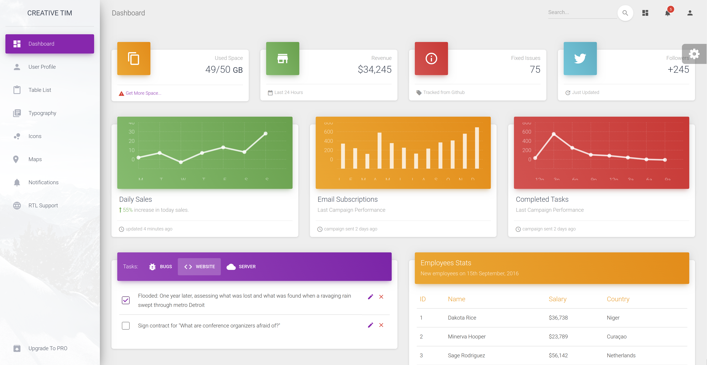

# Material dashboard made in Blazor 
This project intent to port the template Material dashboard project into a Blazor project to be used.

**NOTE:** the components aren't going to be ported **ALL** to blazor. They will continue to be using Javascript in the first version.
With time the components will be replace will full Blazor Components.

# What I learned
* Port a HTML/CSS/Javascript template that can be downloaded from internet into a full blazor project with minor effort.
* Potential of Blazor
* Component structure
* CI/CD with gitLab
    * CI build and run tests
    * When merged to 'github' branch, the CI/CD should push the branch to GitHub

#Screenshots
* Dashboard

